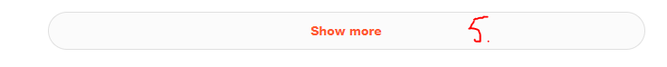

# sportstracker-downloadscript
Javascript snippet to create curl commands for activity batch export from Sports-tracker activity tracker. 

Script creates a curl command with output file name and download url for each activity to download by scraping the activity list and
reading a login token from cookies.

You can export .fit files if you change url in the script (~line 85) from:
> 'https://api.sports-tracker.com/apiserver/v1/workout/exportGpx/'

to
> 'https://api.sports-tracker.com/apiserver/v1/workout/exportFit/' 

and set the filename accordingly.

## Instructions
Login to your sports-tracker account:

1. Go to 'Diary' page
2. Select 'List' view (or change URL to http://www.sports-tracker.com/diary/workout-list)
3. Select filters to select workouts you want to export
4. Select date range (if applicable) and apply filters

5. Press "Show More" link in the bottom of the list and repeat until all workouts are in the list
6. Open your browser development tools and go to 'console' tab (Cmd-Shift-I)

7. paste the script, hit enter - it'll run and print something like this to the console:
  > curl -o 20201214-Cycling-\<activityname\>_\<..id..\>.gpx "https://api.sports-tracker.com/apiserver..."

Output line count should match the amount of activities in your selection.

Right-click on the console & save or copy-paste these curl commands.
After that, open your favorite powershell/bash etc and change to the directory where you want to save gpx files.

Run curl commands to download your activities.

## Credits & Original work
This script is originally from http://druss.co/2016/04/export-all-workouts-from-sports-tracker/

Adapted by Konstatinos Sykas: https://gist.github.com/KonstantinosSykas/dfe4c5e392e299ab9341d6e16299454f

Further changed by Mikko Nieminen: 
- script output set to use https 
- added activity description scraping
- output file name formatted as '\<activity date\>-\<activity type\>-\<activity description\>_\<workout id\>.gpx'
